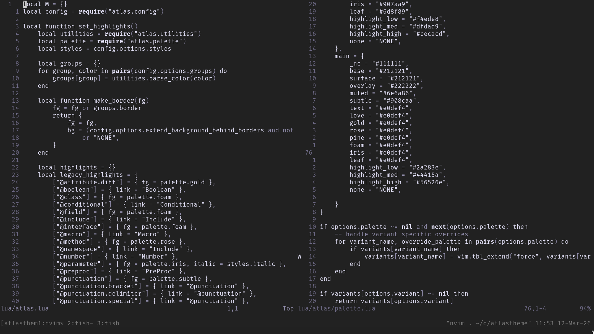

<p align="center">
  
</p>


Atlas theme is a monochrome colorscheme, written in lua for neovim.
This colorscheme is inspired by the original [atlas.vim](https://github.com/huyvohcmc/atlas.vim) 
and ThePrimeagen's [rose-pine](https://github.com/rose-pine/neovim) theme. It has been rewritten in **Lua** to better integrate with modern **Neovim** 
configurations and plugin ecosystems. 

This is a very minimal colorscheme with very little support for all the plugins.
Currently, it only supports `telescope.nvim` and `treesitter-context`. Feel free
to add the additional support for all other plugins.


## Installation

Install using `lazy.nvim`

```lua
return {
  "blameaniket/atlastheme",
  name = "atlastheme",

  -- load the colorscheme before 
  -- any other plugins, to have minimum issues
  lazy = false,
  priority = 1000,

  config = function()
    require("atlas").setup({
      -- no need to call the setup() if you
      -- dont need any kind of 
      -- custom options
    })

    -- apply the colorscheme
    vim.cmd([[colorscheme atlas]])
  end
}
```

<!-- ## ⚙️ Configuration -->
## Configuration

Default configuration:

```lua
require("atlas").setup({
  variant = "main",
  -- the suitable options are
  -- "main"
  -- "minimal"

  disable_background = true,
  -- suitable options are
  -- true: you can get some unique effects
  -- false: as given in the screenshot

  styles = {
    italic = false,
  },
})

vim.cmd([[colorscheme atlas]])
```
Don't forget to call `setup()` if you want your custom colors to be loaded

See `:help atlas.txt` for more information


## Contributing

I welcome and appreciate contributions of any kind. Create an issue or start a
discussion for any proposed changes. Pull requests are encouraged for supporting
additional plugins or treesitter improvements.

Feel free to update the wiki with any recipes.


## License

This project is licensed under the **MIT License**.

See the [`LICENSE`](./LICENSE) file for more information.
